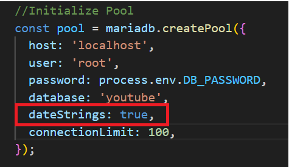

# TIMESTAMP VS DATETIME

#### **DATETIME**

DATETIME은 날짜를 있는 그대로 저장한다

그렇기 때문에 시차와 관계없이 똑같이 읽힌다(미국 에서나 한국에서나 저장된 날짜 그대로 읽힘)

#### **TIMESTAMP**

TIMESTAMP는 숫자값을 저장한다.

이는 그리니치 평균시(GMT)로 1970년 1월 1일 자정부터, 입력되는 시간까지

총 몇 밀리세컨드가 지났는지를 UTC 시간대로 저장한다.

time_zone의 영향을 받는다
time_zone의 기본값은 SYSTEM 이라서 UTC 시간대로 db에 저장되고

time_zone 설정 값에 따라 원하는 형식으로 읽어올 수 있다

node 에서는 TIMESTAMP 데이터를 불러올때 문자열로 변환해줘야 해당 시간대에 맞는 날짜가 문자열로 나온다

#### db연결시 dateString 옵션

